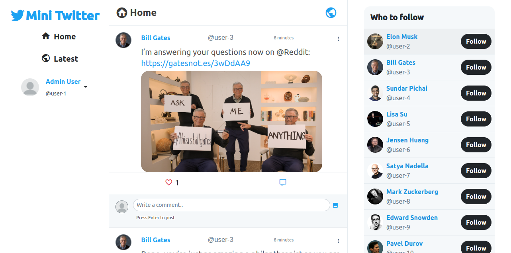

# Mini Twitter

A miniature version of twitter which lets the user to post tweet and attach images with it. User will also be able to like tweet and post comment on tweets, attach image with the comment for better interaction. For the registered user there will be two sections **Home** and **Latest**. User will be able to follow other users and their tweets will be displayed into the **Latest** section.




## Ruby gems used in this build
* [`active_storage_validations`](https://github.com/igorkasyanchuk/active_storage_validations) - for validating active storage content types
* [`bootsnap`](https://github.com/Shopify/bootsnap) - Bootsnap is a library that plugs into Ruby, with optional support for YAML, to optimize and cache expensive computations. See How Does This Work.
* [`devise`](https://github.com/heartcombo/devise) - User authentication
* [`dotenv-rails`](https://github.com/bkeepers/dotenv) - Shim to load environment variables from .env into ENV in development.
* [`rails_autolink`](https://github.com/tenderlove/rails_autolink) - For parsing URL from text data.
* [`simple_form`](https://github.com/heartcombo/simple_form) - For simple forms!
* [`slim`](https://github.com/slim-template/slim-rails) - slim-rails provides Slim generators for Rails 3+
# Environment Configuration
* Required Ruby Version: 3.1.1
* Required Rails Version: 6.1.5.1
* Required DBMS: MySQL

```bash
git clone git@github.com:notorious94/mini-twitter.git
cd mini-twitter
cp .env.sample .env
```

* Open .env file and insert your database credentials and mysql socket path
[]
```bash
bundle install
yarn install
rails db:create
rails db:migrate
rake db:seed
./bin/webpack-dev-server
rails s
```
# Note
Please wait for webpacker compilation to finish before running the app

* Admin Credentials
  * Email: user-1@twitter.com
  * Password: 123456
